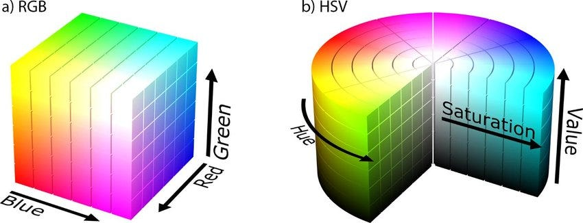

# Изображения, цвет и маски

## Изображение как набор чисел

Цифровая фотография состоит из пикселей, расположенных по строкам и столбцам. Пиксель - элемент изображения, которому приписаны яркость или несколько цветовых значений. Например, фотография 640 на 480 содержит 640*480=307200 пикселей

Серое изображение можно представить таблицей яркостей. Для типа uint8 число 0 обозначает черный цвет, 255 - белый, промежуточные значения - оттенки серого. Маленький пример:

```python
import numpy as np

gray = np.array([[0, 128, 255], [255, 128, 0]], dtype=np.uint8)
```

Здесь две строки и три столбца. В первой строке яркость растет слева направо, во второй уменьшается. Форма массива gray.shape равна (2,3)

Первые две оси изображения имеют порядок (высота, ширина). Значение image[row,column] относится сначала к строке, затем к столбцу. В координатах рисунка x обозначает столбец, y - строку. Начало находится в левом верхнем углу, строки увеличиваются вниз

## Цветовые каналы

Цветной пиксель обычно хранит три значения: красное, зеленое и синее. Канал - отдельная таблица интенсивностей одного цветового компонента. Поэтому цветное изображение имеет форму (H,W,3)

Например, в RGB тройка (255,0,0) обозначает красный пиксель, (0,255,0) - зеленый. Тройка (100,100,100) выглядит серой, потому что вклады всех трех каналов одинаковы

OpenCV читает обычное цветное изображение в порядке BGR. Matplotlib ожидает RGB. Перед показом через Matplotlib порядок меняется:

```python
rgb = cv2.cvtColor(bgr, cv2.COLOR_BGR2RGB)
```

Это перестановка компонентов, а не изменение освещения. Если передать BGR как RGB, красный и синий поменяются местами

Массив bgr[:,:,0] содержит синий канал, bgr[:,:,1] - зеленый, bgr[:,:,2] - красный. При показе канала в градациях серого светлая область означает большой вклад этого компонента. Она не обязана быть белой на исходной фотографии

Переход к оттенкам серого объединяет каналы с разными весами. Для обычного преобразования RGB используется примерно 0.299*R+0.587*G+0.114*B. Например, чистый зеленый пиксель (0,255,0) даст яркость около 150. Серое изображение не совпадает с одним из каналов, оно учитывает все три

Число пикселей H*W отличается от числа элементов массива H*W*3. У изображения 480 на 640 это 307200 пикселей и 921600 отдельных чисел

## Чтение и тип данных

`cv2.imread` читает файл. При неудаче возвращается None, поэтому проверка выполняется перед обращением к shape. Расширение .jpg само по себе не гарантирует, что внутри находится корректное JPEG-изображение

Для uint8 доступны целые числа от 0 до 255. При обычной арифметике NumPy в этом типе возможно переполнение. Например, сумма двух ярких значений может выйти за допустимый диапазон. Для смешивания данные переводятся в float32, затем результат ограничивается через np.clip и возвращается в uint8

## Поиск лица и определение личности

Детекция находит область, похожую на лицо. Она отвечает на вопрос, где лицо находится. Определение личности отвечает на другой вопрос: кому оно принадлежит

Каскад Haar - готовый детектор, который последовательно проверяет простые признаки изменения яркости. Области, явно не похожие на лицо, быстро отбрасываются. Остальные проходят дополнительные проверки. Для применения готового каскада отдельное обучение не требуется

Детектор проверяет изображение на нескольких масштабах, поскольку лица могут занимать разную площадь. scaleFactor задает шаг между масштабами. Значение ближе к 1 означает более подробный перебор и обычно больше вычислений

Несколько близких рамок могут соответствовать одному лицу. minNeighbors влияет на подтверждение и группировку таких находок. Это не число людей, стоящих рядом. Увеличение параметра обычно уменьшает число ложных рамок, но может привести к пропуску лица

Результат detectMultiScale - набор прямоугольников (x,y,width,height). Чтобы нарисовать рамку, используются углы (x,y) и (x+width,y+height)

Поворот головы, маленькое лицо, тени и перекрытие предметами затрудняют поиск. Само количество рамок еще не показывает качество: лишняя рамка на фоне не компенсирует пропущенное лицо. [Описание детекции OpenCV](https://docs.opencv.org/4.x/d7/d8b/tutorial_py_face_detection.html)

## Прозрачность и наложение

Альфа-канал хранит степень непрозрачности. Для PNG он может быть четвертым каналом. При чтении с IMREAD_UNCHANGED OpenCV сохраняет его, возвращая BGRA

Значение alpha=255 означает непрозрачный пиксель, alpha=0 - полностью прозрачный. Для вычислений alpha делится на 255, чтобы получить диапазон от 0 до 1

Смешивание одного пикселя выполняется так:

`result = alpha*foreground + (1-alpha)*background`

Если передний план имеет значение 200, фон 100, а alpha=0.25, результат равен 0.25*200+0.75*100=125. Это взвешенная сумма: каждый источник участвует со своим весом. Правило применяется отдельно к каждому цветовому каналу

Массив alpha формы (H,W,1) позволяет использовать одну прозрачность для всех трех компонентов пикселя. Сначала вставка масштабируется вместе с альфа-каналом, затем смешивается с выбранной областью фона

Положение вставки задается координатами верхнего левого угла. Если вставка выходит за границы, нужно либо уменьшить ее, либо согласованно обрезать и вставку, и область фона. Изменять размер только у одного массива перед смешиванием нельзя

## Цветовая модель HSV



RGB удобно описывает компоненты цвета, но порог для зеленого фона в этих координатах зависит сразу от трех чисел. HSV разделяет цветовой тон H, насыщенность S и яркость V

Тон отвечает примерно за то, какой это цвет. Насыщенность отличает яркий цвет от близкого к серому. Яркость описывает светлую или темную область. В стандартном uint8-представлении OpenCV H лежит от 0 до 179, а S и V - от 0 до 255

Например, пиксели одного зеленого фона в свету и в тени могут иметь похожий тон, но разную яркость. Поэтому диапазон задается сразу по H, S и V. При очень малой насыщенности тон ненадежен: у почти серого пикселя нет выраженного цвета

## Маска

Маска - отдельное изображение, которое указывает, где выполнить действие. `cv2.inRange` возвращает 255 для пикселей внутри заданного диапазона и 0 для остальных

При замене фона удобно считать, что 255 обозначает заменяемый фон, а 0 - сохраняемый объект. На графике такая маска выглядит белой в области фона и черной в области объекта. Инверсия меняет эти роли местами

```python
hsv = cv2.cvtColor(frame, cv2.COLOR_BGR2HSV)
mask = cv2.inRange(hsv, (35, 60, 50), (85, 255, 255))
```

Этот диапазон - пример для зеленого цвета, а не универсальная настройка. Более широкий диапазон может удалить зеленую часть одежды. Слишком узкий оставит тени и блики исходного фона. Правильность маски оценивается по изображению, а не только по числу белых пикселей. [Диапазоны inRange](https://docs.opencv.org/4.x/da/d97/tutorial_threshold_inRange.html)

## Хромакей

Хромакей заменяет фон, выделенный по цвету. Новый фон сначала приводится к размеру кадра. Затем для белых пикселей маски берутся значения нового фона, для черных - исходного кадра

Растягивание точно под размер кадра может исказить пропорции. Другой способ - увеличить изображение до покрытия всей области, затем обрезать лишние края. Пропорции сохраняются, но часть изображения теряется

Жесткая маска дает резкую границу. Ее смягчение может уменьшить ступеньки, но одновременно смешать объект с цветом старого фона. Волосы, прозрачные предметы, тени и зеленые детали объекта остаются сложными случаями

## Видео и время

Видео содержит последовательность кадров. FPS - число кадров в секунду. При постоянном FPS время кадра с номером n равно n/FPS, длительность последовательности из N кадров - N/FPS. Например, 60 кадров при 30 FPS занимают 2 секунды

VideoCapture читает кадры, VideoWriter записывает обработанные изображения. Размер при создании VideoWriter передается как (W,H), хотя shape массива начинается с (H,W). Смена FPS без изменения числа кадров меняет скорость воспроизведения

После записи файл открывается заново. Проверяются читаемость, размер, FPS и количество кадров. Если исходный файл поврежден, остановка чтения не обязательно означает нормальный конец ролика

OpenCV не переносит звуковую дорожку автоматически. Кодек и контейнер должны поддерживаться средой. MJPG в AVI удобен для покадровой записи, но такой файл не всегда воспроизводится в браузере. В этом случае результат можно проверить чтением и показом отдельных кадров. [Работа с видео](https://docs.opencv.org/4.x/dd/d43/tutorial_py_video_display.html)
